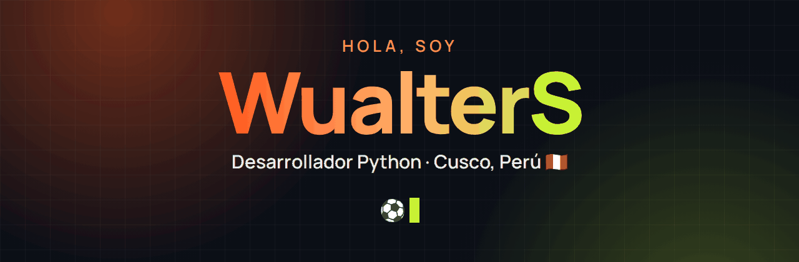
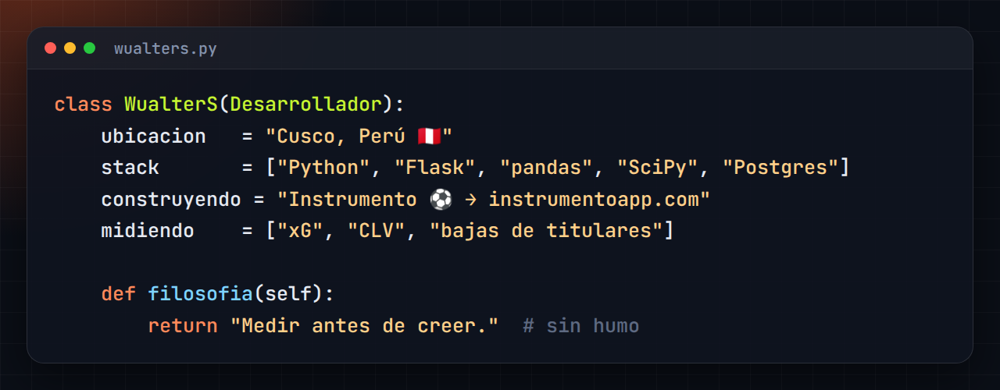
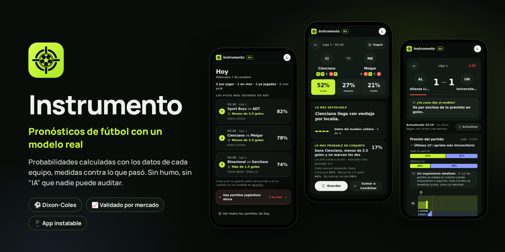
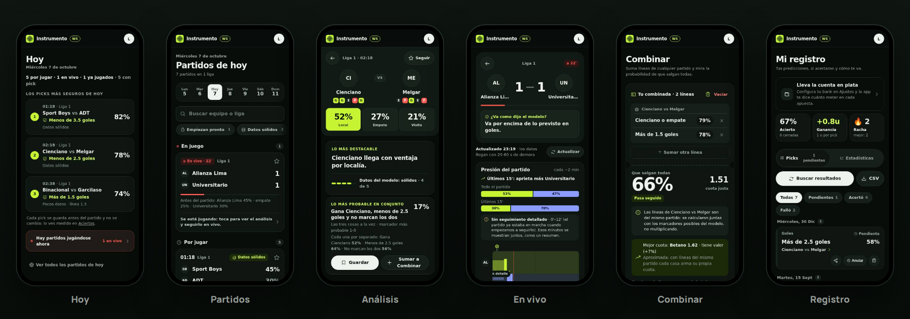
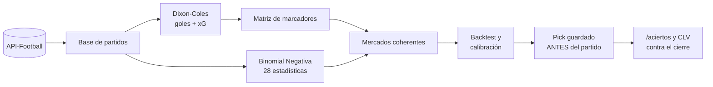
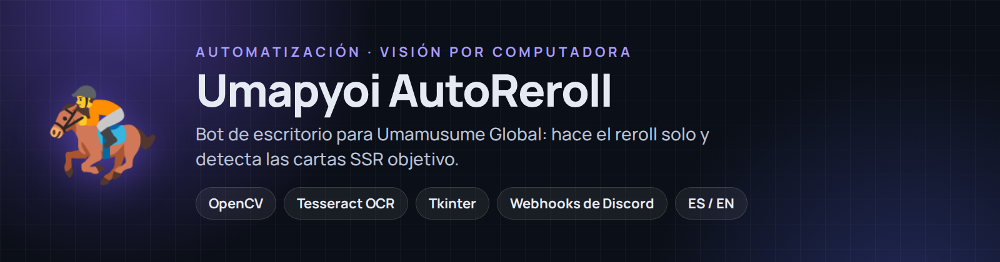

  

  Construyo productos completos: del modelo estadístico al servidor, la interfaz, las pruebas y el cobro.

  
  
  

---

## 👋 Sobre mí

- ⚽ Hoy trabajo en **Instrumento**, una app web que calcula cientos de mercados por partido de fútbol con modelos estadísticos reales y mide si aciertan.
- 📐 Me interesa el **modelado estadístico aplicado**: Dixon-Coles, Binomial Negativa, cópulas, calibración y backtesting.
- 🚀 Me gusta llevar las cosas **a producción**: despliegue en Render, base en Postgres, CI con GitHub Actions y pruebas de interfaz con Playwright.
- 🤖 Empecé automatizando tareas repetitivas con **visión por computadora y OCR** (ver Umapyoi AutoReroll).
- 🔭 Ahora mismo: midiendo con datos reales si el xG, el CLV y las bajas de titulares mejoran los pronósticos.
- 🎮 Fuera del código: videojuegos y mucha música.

---

## 🧭 Proyectos

### ⚽ Instrumento — análisis y predicción de fútbol

> *Calcula cientos de mercados por partido, los compara contra la cuota de la casa y registra si acertaste.*

  
  

☝️ Datos reales de la app, se actualizan solos cada 6 horas. Cada pick se guarda antes del partido y cuentan también los que fallaron.

  
  
  
  
  
  
  
  
  

| | |
|---|---|
| 📈 **Modelos** | Dixon-Coles para goles (con altitud, lesiones y descanso) · Binomial Negativa para 28 estadísticas (córners, tarjetas, tiros…) · cópula gaussiana para combinadas |
| ✅ **Validación** | Backtest contra el mercado, calibración y control de falsos descubrimientos (FDR): cada mercado lleva su sello — *ok*, *ajustado* o *ruido* |
| 🗂️ **Datos** | Ingesta automática de 16 ligas + copas, planteles y mercados de jugador con incertidumbre de minutos |
| 🧠 **Contra el mercado** | Aprende del xG (goles esperados), mide el CLV de cada pick contra la cuota de cierre y si las bajas de titulares pesan más de lo que el modelo ya espera |
| 📱 **Producto** | PWA instalable, picks del día, en vivo con gráfico de presión, combinadas, «¿Cuánto meter?» con el bank del usuario (Kelly fraccionado), registro con yield y calibración, notificaciones push propias (Web Push + VAPID) y referidos |
| 💳 **Negocio** | Plan gratis / Pro controlado en el servidor, cobro por Yape o Plin y Libro de Reclamaciones virtual |
| 🛡️ **Calidad** | ~600 pruebas (pytest + Playwright con pantallas reales) en cada PR, ruff, arquitectura por capas vigilada por una prueba, hilos de fondo con semáforo de salud y avisos por Telegram |

<table>
  <tr>
    <td align="center" width="25%"><h3>~600</h3>pruebas automáticas en cada cambio</td>
    <td align="center" width="25%"><h3>16 + copas</h3>ligas con datos propios</td>
    <td align="center" width="25%"><h3>28</h3>estadísticas por partido modeladas</td>
    <td align="center" width="25%"><h3>100%</h3>de los picks guardados antes del partido</td>
  </tr>
</table>

<b>🧠 Cómo funciona por dentro</b>

 

- Todo sale de una sola matriz de marcadores: quién gana, goles y ambos marcan nunca se contradicen.
- Walk-forward: entrena con el pasado, predice lo siguiente y avanza; un mercado que no supera el control de falsos descubrimientos se marca como *ruido*.
- El historial público no se recalcula: lo que se ve es lo que el modelo dijo antes de cada partido.

~26 000 líneas de Python · ~9 000 de JavaScript sin frameworks · código privado · 🔗 <a href="https://instrumentoapp.com">instrumentoapp.com</a>

 

### 🏇 Umapyoi AutoReroll — automatización para Umamusume Global

Bot de escritorio que automatiza el reroll del juego: acepta términos, crea el perfil, reclama recompensas, tira el gacha y **detecta las cartas SSR objetivo** con OpenCV + Tesseract OCR. Avisa por webhook de Discord e incluye interfaz en español e inglés.

  
  
  
  
  

---

## 🛠️ Stack

**Lenguajes** 

**Backend y datos** 
 

**Automatización** 

**Deploy y calidad** 
 

---

## 🐍 Actividad

  
   
  La serpiente se come mis contribuciones del año (se actualiza sola cada día).

---

## 💡 Cómo trabajo

- **Medir antes de creer.** Un modelo sin validación es una opinión: por eso cada mercado de Instrumento pasa por backtest y calibración antes de mostrarse como confiable.
- **Honestidad con el usuario.** La app dice lo que *no* puede hacer y por qué (por ejemplo, no scrapea cuotas para no arriesgar la cuenta del usuario).
- **Cambios pequeños y verificables.** PRs chicos, pruebas automáticas y documentación de cada decisión.

---

<b>🇺🇸 English</b>

 

**Python developer from Cusco, Peru.** I build complete products: from the statistical model to the server, the UI, the tests and the billing.

**⚽ Instrumento** — a football analytics web app that prices hundreds of markets per match with real statistical models (Dixon-Coles for goals, Negative Binomial for 28 match stats, a Gaussian copula for accumulators), backtests them against bookmaker odds, measures closing-line value, and tracks calibration and yield for every saved pick — with a public, verifiable track record. Built with Flask, pandas and SciPy, persisted in PostgreSQL (Neon), deployed on Render as an installable PWA, with a Free/Pro plan and CI running pytest + Playwright on every PR. **[Try it live →](https://instrumentoapp.com)**

**🏇 Umapyoi AutoReroll** — a desktop bot that automates rerolling in Umamusume Global using OpenCV and Tesseract OCR to detect target SSR cards, with Discord webhook notifications and an English/Spanish UI.

---

  
    
  

