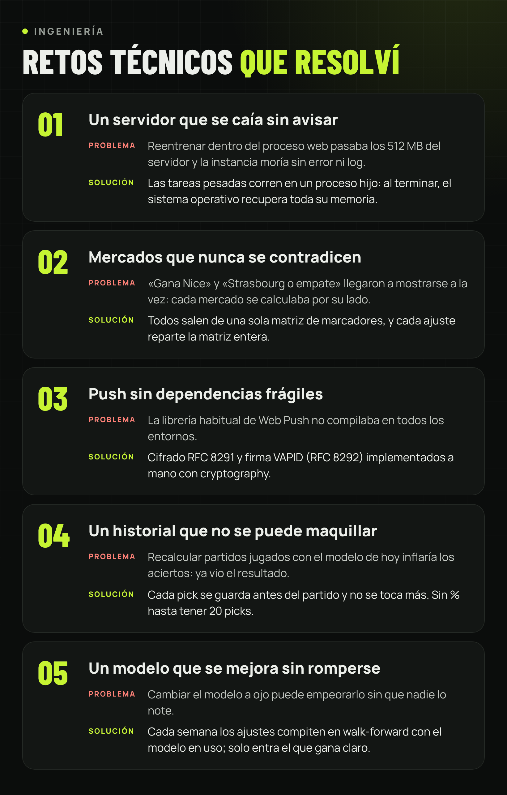
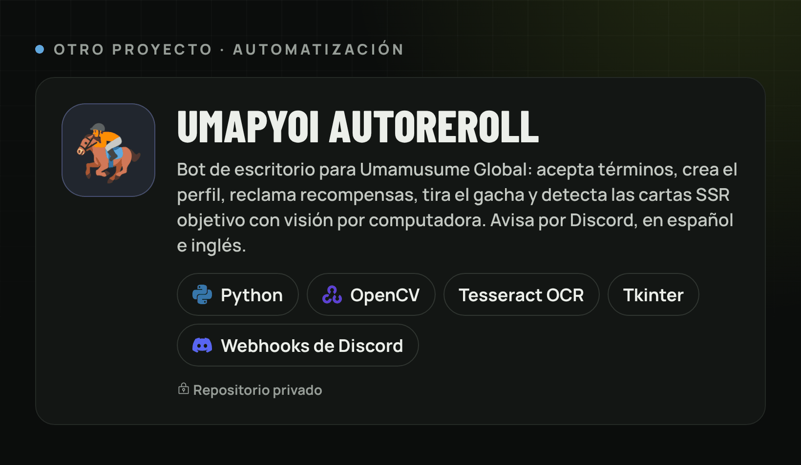

Desarrollo productos de datos de punta a punta: el modelo estadístico, el servidor, la interfaz, las pruebas y el despliegue. Hoy construyo **Instrumento**, una app web gratis de pronósticos de fútbol que publica cuánto acierta, incluidos los picks que fallan.

  
  
  

Datos reales de la app, actualizados solos cada 6 horas.

Interfaz real de la app, con datos de ejemplo.

<b>English</b>

 

**Python developer from Cusco, Peru.** I build data products end to end: the statistical model, the server, the UI, the tests and the deployment.

**Instrumento** ([instrumentoapp.com](https://instrumentoapp.com)) is a free football analytics web app. It prices hundreds of markets per match with statistical models (Dixon-Coles for goals, Negative Binomial for match stats, a Gaussian copula for accumulators), compares them with bookmaker odds, saves every pick before kick-off and publishes its track record, misses included. Started in late August 2026, with 300+ pull requests in six weeks. It retrains daily and runs a weekly self-improvement loop that only ships changes that beat the current model on unseen matches. Built with Flask, pandas, SciPy and PostgreSQL, deployed on Render as an installable PWA, with ~770 automated tests (pytest + Playwright) on every change. Source code is private.

**Umapyoi AutoReroll** is a desktop bot that automates rerolling in Umamusume Global, using OpenCV and Tesseract OCR to detect target SSR cards, with Discord notifications and an English/Spanish UI. Private repository.

